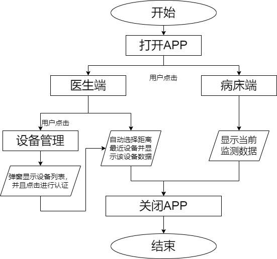
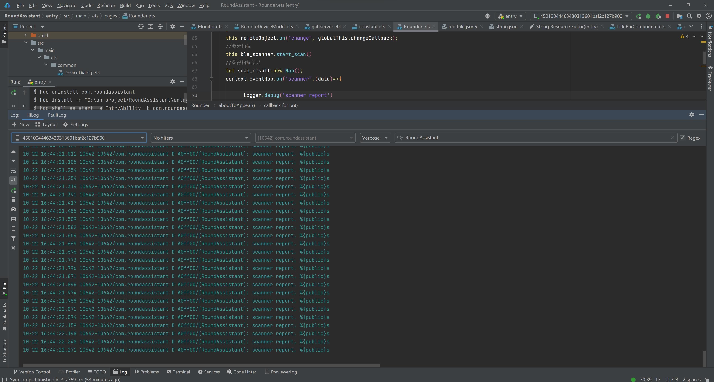
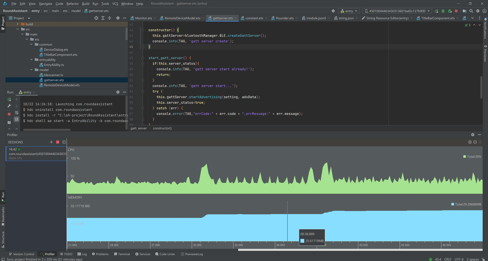

# 病床巡检终端

## 简介

2023年OH竞赛训练营行业使能赛题参赛作品：题目九病床巡检终端。 基于OpenHarmony 3.2Release开发，通过分布式软总线进行设备配对组网，根据蓝牙距离判断需同步设备并进行数据同步。

具体项目文档见仓库内文件[`README.assets/项目开发文档.docx`](https://gitee.com/noiatrio/round-assistant/blob/master/README.assets/项目开发文档.docx)，附有演示ppt[`README.assets/病床巡检终端.pptx`](https://gitee.com/noiatrio/round-assistant/blob/master/README.assets/病床巡检终端.pptx)。

hap安装包见仓库发行版界面[`RoundAssistant 发行版`](https://gitee.com/noiatrio/round-assistant/releases)。

## 演示视频

- 设备组网并信任

[README.assets/设备组网并添加信任.mp4](https://gitee.com/noiatrio/round-assistant/blob/master/README.assets/%E8%AE%BE%E5%A4%87%E7%BB%84%E7%BD%91%E5%B9%B6%E6%B7%BB%E5%8A%A0%E4%BF%A1%E4%BB%BB.mp4)

- 模拟巡检

[README.assets/模拟巡检.mp4](https://gitee.com/noiatrio/round-assistant/blob/master/README.assets/模拟巡检.mp4)

## 概要说明

### 背景

数字化技术正在蓬勃发展，医院的智慧化转型正在加速。物联终端接入、信息化诊疗的普及都在加速医院智慧化升级的步伐。心率、血氧、体温等基础病人数据是医生和护理人员衡量病人状态的关键指标，如何更快速更方便的获取病床上病人的这些数据，也成为智慧化医院所考虑的一项重要工作。

### 问题描述

如图所示病房内有多张病床，每张病床配备有端侧设备收集病人的心率、血氧、体温等生理数据。医生手持端侧设备进行病房查房，端侧设备间可通过蓝牙进行连接。当其走到病人A床尾时，由于A端侧设备距离最近，自动通过病人A的端侧设备获取该病人的生理数据，进行检视判断。当其走到病人B床尾时，通过病人B的端侧设备获取该病人的生理数据。现用两台开发板设备模拟不同病人的端侧设备，用另一台开发板模拟医生手持设备实现该功能。


### 技术挑战

1. 通过分布式软总线进行设备配对组网
2. 根据蓝牙距离判断需同步设备并进行数据同步

### 赛题目标

#### 基础目标

1. 实现设备间分布式组网，并且根据距离与最近设备建立连接
2. 实现数据同步，获取到最近设备的相应模拟数据

#### 挑战目标

1. 界面可视化，实现医生查房系统

### 项目介绍

考虑赛题目标，我们在OpenHarmony v3.2Release版本下使用以下模块，来完成了对应目标：

1.使用`@ohos.distributedHardware.deviceManager`模块实现了分布式设备管理，完成了设备组网配对的功能

2.使用`@ohos.bluetoothManager`模块实现了蓝牙的BLE的扫描、广播功能，完成了依据信号强度判断最近距离设备的功能

3.使用了`@ohos.data.distributedDataObject`模块实现了分布式数据对象的协同管理，完成了自动同步设备数据的功能

在此基础上，我们提供了ui界面，将APP分为病床端和医生端：在病床端进行BLE广播，以及数据的输入；在医生端进行设备管理，BLE扫描以及数据同步与显示。除此之外实现了权限的管理，在程序运行开始时会询问用户来获得权限。特别的是，我们还实现了设备切换的防抖动，在距离最近的设备1s内没有发生改变后将当前数据同步设备进行切换，防止了同步设备的频繁切换。

### 开发环境及工具

- 系统环境：Windos 11
- 开发板环境：RK3568开发板并配置OpenHarmony v3.2系统
- 开发工具：devecostudio-windows-3.1.0.501
- SDK：api 9版本full SDK

## 设计思路

### 需求分析

依据病床巡检终端的使用背景、描述以及完成目标，我们将病床巡检终端按需求分为以下几点：

1. 设备间分布式组网：病床上的端侧设备需要能够通过分布式软总线进行配对组网。这意味着设备需要支持分布式通信，能够发现和连接其他设备。这样，医生手持设备就可以与最近的病床端侧设备建立连接。
2. 蓝牙距离判断：医生手持设备在巡检过程中，需要根据蓝牙信号的强度判断与最近的病床端侧设备的距离。可以通过比较不同设备之间的蓝牙信号强度来确定最近的设备。一旦确定最近的设备，医生手持设备需要与该设备进行数据同步，获取病人的心率、血氧、体温等生理数据。
3. 数据同步：医生手持设备需要与最近的病床端侧设备建立数据同步。一旦连接建立，医生手持设备可以请求病人的生理数据，并将其显示在界面上供医生查看。数据同步需要确保数据的准确性和及时性。
4. 界面可视化：为了方便医生查房，需要实现一个界面可视化的医生查房系统。该系统可以显示病人的基础生理数据，如心率、血氧、体温等。医生可以通过界面进行操作和查看数据，以便做出准确的判断和决策。

### 设计思路

根据以上需求分析我们结合OpenHarmony系统库提出了对应的解决方案：

1. 设备间分布式组网：使用了`@ohos.distributedHardware.deviceManager`解决，该模块提供分布式设备管理能力。系统应用可调用接口实现如下功能：
   - 注册和解除注册设备上下线变化监听
   
   - 发现周边不可信设备
   
   - 认证和取消认证设备
   
   - 查询可信设备列表
   
   - 查询本地设备信息，包括设备名称，设备类型和设备标识
   
   - 发布设备发现
2. 蓝牙距离判断：使用了`@ohos.bluetoothManager `解决，该模块提供了基础的传统蓝牙能力以及BLE的扫描、广播等功能。
3. 数据同步：使用了`@ohos.data.distributedDataObject`解决，该模块提供管理基本数据对象的相关能力，包括创建、查询、删除、修改、订阅等；同时支持相同应用多设备间的分布式数据对象协同能力。
4. 界面可视化：使用ArkTS语言开发，通过UI的配置将应用中分为病床端和医生端，病床端显示当前监察数据，医生端进行设备管理以及同步数据的显示，实现了界面可视，便于使用。

## 业务流程图

用户使用流程如下图所示



## 模块与功能实现

### 代码目录结构

```
─main
  │  module.json5  //配置文件
  │
  ├─ets
  │  ├─common
  │  │      DeviceDialog.ets    //设备显示弹窗类
  │  │      TitleBarComponent.ets   //包含设备管理的标题栏组件
  │  │
  │  ├─entryability
  │  │      EntryAbility.ts  //程序入口类
  │  │
  │  ├─model
  │  │      blescanner.ts 	 //ble扫描类
  │  │      gattserver.ets 	 //gatt server类
  │  │      RemoteDeviceModel.ets  //分布式设备管理类
  │  │
  │  ├─pages
  │  │      Monitor.ets  //病床端主页
  │  │      Rounder.ets  //医生端主页
  │  │      welcome.ets  //首页
  │  │
  │  └─util
  │          constant.ets //常量
  │          Logger.ts    //日志类
  │          Permission.ts //请求权限类
  │
  └─resources
      ├─base
      │  ├─element
      │  ├─media
      │  │
      │  └─profile
      │          main_pages.json
      ├─en_US
      ├─rawfile
      └─zh_CN

```

### 模块与功能

#### 页面显示

- 首页：`welcome.ets`；在`aboutTOAppear`先进行权限验证；在UI中提供两个按钮实现跳转病床端主页或医生端主页。
- 病床端主页：`Monitor.ets`；创建了`distributedDataObject`类对象进行数据同步；在`aboutTOAppear()`开启了BLE蓝牙广播；在`aboutTODisppear()`中进行关闭广播。
- 医生端主页：`Rounder.ets`；创建了`distributedDataObject`类对象进行数据同步，还创建了`remoteDeviceModel`进行设备管理；在`aboutTOAppear()`中进行蓝牙扫描，并对扫描事件进行监听，在信号最强的设备发生改变时更改同步数据的设备，同时实现了防抖动的设计；在UI中使用了标题栏组件，并进行了当前同步数据的显示；在`onDestroy()`中进行了`remoteDeviceModel`的各监听的停止。
- 标题栏组件：`TitleBarComponent.ets`；真正使用了`remoteDeviceModel`，并创建了`deviceList`来保存当前的设备列表；在UI中使用了按钮，当按下后会进行`remoteDeviceModel`类中包含`createDeviceManager()`等的注册函数，并进行回调了回调函数的传入来更新`deviceList`，通过`deviceList`并使用`DeviceDialog.ets`来先渲染显示弹窗，当点击设备时可进行设备的认证。
- 设备显示弹窗组件：`DeviceDialog.ets`；按列表显示当前发现设备列表，并将用户点击操作反馈给标题栏组件，调用对应函数。

#### 功能模块

-  分布式设备管理模块：`RemoteDeviceModel.ets`；

  导入了分布式设备管理库`import deviceManager from '@ohos.distributedHardware.deviceManager'`;

  创建了`DeviceManager`类对象，`deviceList`保存认证设备列表，`discoverList`保存发现设备列表；

  主要使用了`deviceManager`下的`createDeviceManager()`方法,以及`DeviceManager`类下的`startDeviceDiscovery()`,`getTrustedDeviceListSync()`,`on('deviceStateChange', ())`,`on('deviceFound', ())`,`on('discoverFail', ())`,`on('serviceDie', ())`,`authenticateDevice()`等方法，实现了分布式设备组网。
  
- 分布式数据对象模块：在`Monitor.ets`,`Rounder.ets`都有使用；

  导入了分布式数据对象库`import distributedDataObject from '@ohos.data.distributedDataObject'`;

  创建了`DataObject`类对象；

  使用了`distributedDataObject`的`create()`方法，以及`DataObject`类下的`setSessionId()`,`on('change')`,等方法，实现了医生端设备及时与对应的病床端设备进行数据同步。

- 蓝牙模块：`gattserver.ets`,`blescanner.ts`;

  导入了蓝牙管理库`import bluetoothManager from '@ohos.bluetoothManager'`;

  在`blescanner.ts`中主要使用了`bluetoothManager`下`BLE`类的`startBLEScan()`,`on("BLEDeviceFind", ())`方法，实现了BLE蓝牙的扫描，以及扫描事件发生的监听。

  在`gattserver.ets`中主要使用了`bluetoothManager`下`BLE`类的`createGattServer()`创建了`GattServer`类对象,并使用了`bluetoothManager`下`gattServer`类的`startAdvertising()`,`stopAdvertising()`方法实现了广播。

#### 其它模块

- 日志模块：`Logger.ts`；进行日志的打印。
- 常量模块：`constant.ets`；保存一些常量。
- 请求权限模块：`Permission.ts`；弹窗向用户请求对应权限。

## 项目特性

### 用户交互 

本应用界面便于用户交互，有以下特点：

- **简明易懂：** 系统提供了简单直观的操作界面，使用户能够快速上手并轻松使用应用。界面布局清晰，功能按钮和菜单应有明确的标识和描述，以便用户能够准确理解和使用各项功能。
- **可视化：** 应用提供便于操作的UI界面，能直观的便于用户查看，同时在切换设备时，应用能够切换显示图标颜色提示用户当前设备的改变。
- **实时刷新：** 使用ArkTS语言的`@State`装饰器以及低延迟的数据同步，应用能够实时获取和更新病人的生理数据，并在界面上进行实时刷新。当病人的数据发生变化时，系统应立即更新相应的数据显示，以便医生能够及时获取最新的数据状态。并且实时刷新的速度较快，保证了数据的实时性和准确性。

### 防抖动设计

本应用在设计后发现医生端设备在距离多个病床端设备距离相对一致时，容易发生同步设备频繁切换的现象，为了解决这一问题，我们进行了防抖动设计。

在防抖动设计中主要使用了计时器的功能，当检测到距离最近设备与当前设备不一致时，开始打开计时器，准备在1s后进行切换，此时再接收到距离最近设备与准备切换的设备不一致的信息时，就会清空计时器，防止了设备的频繁切换，而如果信号稳定，始终为新的设备，则进行切换。

### 蓝牙测距设计

蓝牙测距功能实现：

1. 设备配置：
     -  病床设备端将自身设置为蓝牙低功耗（BLE）设备，并启用GATT服务器功能。
     - 医生设备端作为中央设备，启用蓝牙扫描功能，并配置为GATT客户端。

2. 广播数据包：
      -  病床设备端使用GATT服务器广播数据包，其中包含以下字段：
      - 制造商标识（Manufacturer ID）：用于识别设备制造商，此项目使用的设备制造商id为0x4444，与serviceUUID一起用来协助过滤出病床设备。
      - 服务标识（Service ID）：用于标识设备提供的特定服务。
      - 添加服务，此项目使用的serviceUUID为 `00001889-0000-1000-8000-00805f9b34fb`，即0x1889，对应的serviceValue表示设备的id。

3. 医生设备端扫描与过滤：
     -  医生设备端启动蓝牙扫描功能，以搜索周围的BLE设备。
     - 扫描到的设备广播报文中，医生设备端过滤出具有匹配的制造商标识和服务标识的设备。

4. 获取、解析广播报文，确定设备距离：
     - 医生设备端通过蓝牙扫描获取到的广播报文中，定位到病床设备端的广播数据包。
     - 医生设备端解析病床设备端的广播数据包，提取出相关字段。
     - 使用已提取的设备标识符字段，医生设备端可以确定病床设备端与自身的距离。
      基于信号强度指示（RSSI）值可以进行距离的确定。

通过以上步骤，蓝牙测距功能可以实现病床设备端与医生设备端之间的距离测量。

### 距离刷新率

本应用接受广播信号日志如下图所示，1秒内检测最近距离设备约20次。距离刷新率约为20hz。



### 延迟

根据https://docs.openharmony.cn/pages/v3.2/zh-cn/application-dev/database/data-sync-of-distributed-data-object.md/，分布式数据对象跨设备同步中，设备A修改1KB数据，设备B收到变更通知，50ms内完成。

### 内存

本应用消耗内存与CPU情况如下图，大约消耗30MB内存。注意当应用在主界面时内存占用较少，进入病床端时内存占用少量增加，当进入医生端时内存消耗达到最高。



### 安全性

1.本应用可以进行了分布式组网的认证调用，通过PIN码来进行认证，保证了设备认证的安全性。

2.本应用在权限管理上实现了应用安装后第一次使用时，申请对应权限，并将其保存，下次启动无需再次给予权限，保证了权限分配的安全性。

